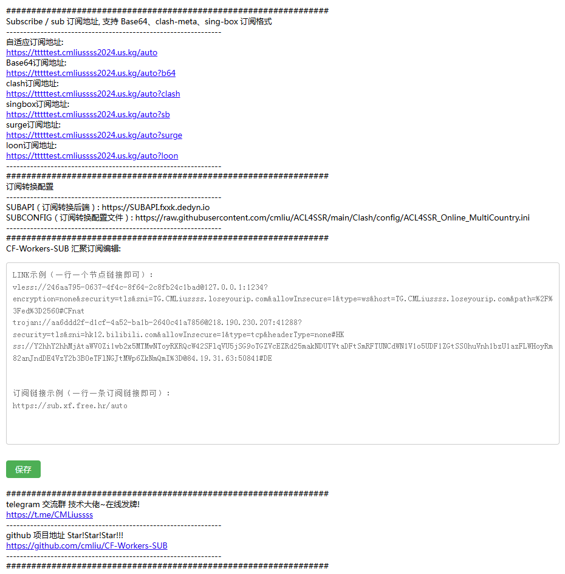

# ⚙ 自建汇聚订阅 CF-Workers-SUB



这是一个将多个节点和订阅合并为单一链接的工具，支持自动适配与自定义分流，简化了订阅管理。

> [!CAUTION]
> **汇聚订阅非base64订阅时**，会自动生成一个**有效期为24小时的临时订阅**，并提交给**订阅转换后端**来完成订阅转换，可避免您的汇聚订阅地址泄露。

> [!WARNING]
> **汇聚订阅非base64订阅时**，如果您的节点数量**十分庞大**，订阅转换后端将需要较长时间才能完成订阅转换，这会导致部分梯子客户端在订阅时提示超时而无法完成订阅（说直白一点就是**汇聚节点池的节点时容易导致Clash订阅超时**）！
>
> 可自行删减订阅节点数量，提高订阅转换效率！

## 🛠 功能特点
1. **节点链接自动转换成base64订阅链接：** 这是最基础的功能，可以将您的节点自动转换为base64格式的订阅链接；
2. **将多个base64订阅汇聚成一个订阅链接：** 可以将多个订阅（例如不同的机场）合并成一个订阅，只需使用一个订阅地址即可获取所有节点；
3. **自动适配不同梯子的格式订阅链接：** 依托[订阅转换](https://sub.cmliussss.com/)服务，自动将订阅转换为不同梯子所需的格式，实现一条订阅适配多种梯子；
4. **专属代理分流规则：** 自定义分流规则，实现个性化的分流模式；
5. **更多功能等待发掘...**

## 🎬 视频教程
- **[自建订阅！CF-Workers-SUB 教你如何将多节点多订阅汇聚合并为一个订阅！](https://youtu.be/w6rRY4FDd58)**

## 🤝 社区支持
- Telegram 交流群: [@CMLiussss](https://t.me/CMLiussss)
- 感谢 [Alice Networks](https://alicenetworks.net/) 提供的云服务器维持 [CM订阅转换服务](https://sub.cmliussss.com/)

## 📦 Pages 部署方法

<details>
<summary><code><strong>「 Pages GitHub 部署文字教程 」</strong></code></summary>

### 1. 部署 Cloudflare Pages：
   - 在 Github 上先 Fork 本项目，并点上 Star !!!
   - 在 Cloudflare Pages 控制台中选择 `连接到 Git`后，选中 `CF-Workers-SUB`项目后点击 `开始设置`。

### 2. 给 Pages绑定 自定义域：
   - 在 Pages控制台的 `自定义域`选项卡，下方点击 `设置自定义域`。
   - 填入你的自定义次级域名，注意不要使用你的根域名，例如：
     您分配到的域名是 `fuck.cloudns.biz`，则添加自定义域填入 `sub.fuck.cloudns.biz`即可；
   - 按照 Cloudflare 的要求将返回你的域名DNS服务商，添加 该自定义域 `sub`的 CNAME记录 `CF-Workers-SUB.pages.dev` 后，点击 `激活域`即可。

### 3. 修改 快速订阅入口 ：

  例如您的pages项目域名为：`sub.fuck.cloudns.biz`；
   - 添加 `TOKEN` 变量，快速订阅访问入口，默认值为: `auto` ，获取订阅器默认节点订阅地址即 `/auto` ，例如 `https://sub.fuck.cloudns.biz/auto`

### 4. 添加你的节点和订阅链接：
   1. 绑定**变量名称**为`KV`的**KV命名空间**；
   2. 访问 `https://sub.fuck.cloudns.biz/auto`，添加你的自建节点链接和机场订阅链接，确保每行一个链接，例如：
      ```
      vless://b7a392e2-4ef0-4496-90bc-1c37bb234904@cf.090227.xyz:443?encryption=none&security=tls&sni=edgetunnel-2z2.pages.dev&fp=random&type=ws&host=edgetunnel-2z2.pages.dev&path=%2F%3Fed%3D2048#%E5%8A%A0%E5%85%A5%E6%88%91%E7%9A%84%E9%A2%91%E9%81%93t.me%2FCMLiussss%E8%A7%A3%E9%94%81%E6%9B%B4%E5%A4%9A%E4%BC%98%E9%80%89%E8%8A%82%E7%82%B9
      vmess://ew0KICAidiI6ICIyIiwNCiAgInBzIjogIuWKoOWFpeaIkeeahOmikemBk3QubWUvQ01MaXVzc3Nz6Kej6ZSB5pu05aSa5LyY6YCJ6IqC54K5PuiLseWbvSDlgKvmlabph5Hono3ln44iLA0KICAiYWRkIjogImNmLjA5MDIyNy54eXoiLA0KICAicG9ydCI6ICI4NDQzIiwNCiAgImlkIjogIjAzZmNjNjE4LWI5M2QtNjc5Ni02YWVkLThhMzhjOTc1ZDU4MSIsDQogICJhaWQiOiAiMCIsDQogICJzY3kiOiAiYXV0byIsDQogICJuZXQiOiAid3MiLA0KICAidHlwZSI6ICJub25lIiwNCiAgImhvc3QiOiAicHBmdjJ0bDl2ZW9qZC1tYWlsbGF6eS5wYWdlcy5kZXYiLA0KICAicGF0aCI6ICIvamFkZXIuZnVuOjQ0My9saW5rdndzIiwNCiAgInRscyI6ICJ0bHMiLA0KICAic25pIjogInBwZnYydGw5dmVvamQtbWFpbGxhenkucGFnZXMuZGV2IiwNCiAgImFscG4iOiAiIiwNCiAgImZwIjogIiINCn0=
      https://sub.xf.free.hr/auto
      https://hy2sub.pages.dev
      ```

</details>

## 🛠️ Workers 部署方法

<details>
<summary><code><strong>「 Workers 部署文字教程 」</strong></code></summary>

### 1. 部署 Cloudflare Worker：

   - 在 Cloudflare Worker 控制台中创建一个新的 Worker。
   - 将 [_worker.js](https://github.com/cmliu/CF-Workers-SUB/blob/main/_worker.js)  的内容粘贴到 Worker 编辑器中。


### 2. 修改 订阅入口 ：

  例如您的workers项目域名为：`sub.cmliussss.workers.dev`；
   - 通过修改 `mytoken` 赋值内容，达到修改你专属订阅的入口，避免订阅泄漏。
     ```
     let mytoken = 'auto';
     ```
     如上所示，你的订阅地址则如下：
     ```url
     https://sub.cmliussss.workers.dev/auto
     或
     https://sub.cmliussss.workers.dev/?token=auto
     ```


### 3. 添加你的节点或订阅链接：
   1. 绑定**变量名称**为`KV`的**KV命名空间**；
   2. 访问 `https://sub.cmliussss.workers.dev/auto`，添加你的自建节点链接和机场订阅链接，确保每行一个链接，例如：
      ```
      vless://b7a392e2-4ef0-4496-90bc-1c37bb234904@cf.090227.xyz:443?encryption=none&security=tls&sni=edgetunnel-2z2.pages.dev&fp=random&type=ws&host=edgetunnel-2z2.pages.dev&path=%2F%3Fed%3D2048#%E5%8A%A0%E5%85%A5%E6%88%91%E7%9A%84%E9%A2%91%E9%81%93t.me%2FCMLiussss%E8%A7%A3%E9%94%81%E6%9B%B4%E5%A4%9A%E4%BC%98%E9%80%89%E8%8A%82%E7%82%B9
      vmess://ew0KICAidiI6ICIyIiwNCiAgInBzIjogIuWKoOWFpeaIkeeahOmikemBk3QubWUvQ01MaXVzc3Nz6Kej6ZSB5pu05aSa5LyY6YCJ6IqC54K5PuiLseWbvSDlgKvmlabph5Hono3ln44iLA0KICAiYWRkIjogImNmLjA5MDIyNy54eXoiLA0KICAicG9ydCI6ICI4NDQzIiwNCiAgImlkIjogIjAzZmNjNjE4LWI5M2QtNjc5Ni02YWVkLThhMzhjOTc1ZDU4MSIsDQogICJhaWQiOiAiMCIsDQogICJzY3kiOiAiYXV0byIsDQogICJuZXQiOiAid3MiLA0KICAidHlwZSI6ICJub25lIiwNCiAgImhvc3QiOiAicHBmdjJ0bDl2ZW9qZC1tYWlsbGF6eS5wYWdlcy5kZXYiLA0KICAicGF0aCI6ICIvamFkZXIuZnVuOjQ0My9saW5rdndzIiwNCiAgInRscyI6ICJ0bHMiLA0KICAic25pIjogInBwZnYydGw5dmVvamQtbWFpbGxhenkucGFnZXMuZGV2IiwNCiAgImFscG4iOiAiIiwNCiAgImZwIjogIiINCn0=
      https://sub.xf.free.hr/auto
      https://hy2sub.pages.dev
      ```

</details>

## 📋 变量说明
| 变量名 | 示例 | 必填 | 备注 | 
|-|-|-|-|
| TOKEN | `auto` | ✅ | 汇聚订阅的订阅配置路径地址，例如：`/auto` | 
| GUEST | `test` | ❌ | 汇聚订阅的访客订阅TOKEN，例如：`/sub?token=test` | 
| LINK | `vless://b7a39...`,`vmess://ew0K...`,`https://sub...` | ❌ | 可同时放入多个节点链接与多个订阅链接，链接之间用换行做间隔（添加**KV命名空间**后，变量将不会使用）|
| TGTOKEN | `6894123456:XXXXXXXXXX0qExVsBPUhHDAbXXXXXqWXgBA` | ❌ | 发送TG通知的机器人token | 
| TGID | `6946912345` | ❌ | 接收TG通知的账户数字ID | 
| SUBNAME | `CF-Workers-SUB` | ❌ | 订阅名称 |
| SUBAPI | `SUBAPI.cmliussss.net` | ❌ | clash、singbox等 订阅转换后端 | 
| SUBCONFIG | [https://raw.github.../ACL4SSR_Online_MultiCountry.ini](https://raw.githubusercontent.com/cmliu/ACL4SSR/main/Clash/config/ACL4SSR_Online_MultiCountry.ini) | ❌ | clash、singbox等 订阅转换配置文件 | 


## ⚠️ 注意事项
项目中，TGTOKEN和TGID在使用时需要先到Telegram注册并获取。其中，TGTOKEN是telegram bot的凭证，TGID是用来接收通知的telegram用户或者组的id。


## ⭐ Star 星星走起
[](https://starchart.cc/cmliu/CF-Workers-SUB)


# 🙏 致谢
[Alice Networks LTD](https://alicenetworks.net/)，[mianayang](https://github.com/mianayang/myself/blob/main/cf-workers/sub/sub.js)、[ACL4SSR](https://github.com/ACL4SSR/ACL4SSR/tree/master/Clash/config)、[肥羊](https://sub.v1.mk/)
